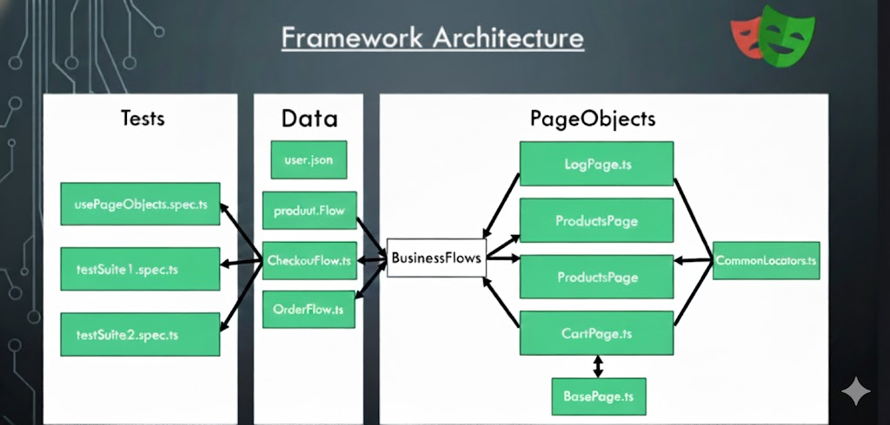

# Playwright UI Test Automation Framework

This repository contains a robust and scalable UI test automation framework built with Playwright and TypeScript. It is designed to test the Conduit real-world example application, demonstrating industry-standard best practices and design patterns for writing clean, maintainable, and efficient UI tests.

## Table of Contents

- [Tech Stack](#tech-stack)
- [Getting Started](#getting-started)
  - [Prerequisites](#prerequisites)
  - [Installation](#installation)
- [Executing Tests](#executing-tests)
- [CI/CD Integration](#cicd-integration)
- [Framework Architecture](#framework-architecture)
- [Folder Structure](#folder-structure)
- [Core Concepts & Design Patterns](#core-concepts--design-patterns)
  - [Page Object Model (POM)](#page-object-model-pom)
  - [Business Flows / Action Layer](#business-flows--action-layer)
  - [Page Manager Pattern](#page-manager-pattern)
  - [Fixtures for Authentication](#fixtures-for-authentication)
- [Error Handling Best Practices](#error-handling-best-practices)
  - [The Golden Rule](#the-golden-rule)
  - [Correct Error Wrapping](#correct-error-wrapping)
- [How to Write a New Test](#how-to-write-a-new-test)

## Tech Stack

- **Test Runner:** [Playwright](https://playwright.dev/)
- **Language:** [TypeScript](https://www.typescriptlang.org/)
- **CI/CD:** [GitHub Actions](./.github/workflows/playwright.yml)

## Getting Started

### Prerequisites

- [Node.js](https://nodejs.org/en/) (v18 or higher recommended)
- An NPM client (npm, pnpm, or yarn)

### Installation

1.  **Clone the repository:**
    ```bash
    git clone <repository-url>
    cd pw-ui-test-fw
    ```

2.  **Install project dependencies:**
    ```bash
    npm install
    ```

3.  **Install Playwright browsers:**
    ```bash
    npx playwright install
    ```

## Executing Tests

This framework comes with pre-configured scripts to run different test suites based on tags.

-   **Run the Sanity Suite:**
    ```bash
    npm run conduit-sanity
    ```
    This executes all tests tagged with `@sanity`.

-   **Run the BVT (Build Verification Test) Suite:**
    ```bash
    npm run conduit-bvt
    ```
    This executes tests tagged with `@sanity`, `@smoke`, `@regression`, or `@bvt`.

-   **Run all tests:**
    ```bash
    npx playwright test
    ```

-   **View the HTML Report:**
    After a test run, a detailed HTML report is generated.
    ```bash
    npx playwright show-report
    ```

## CI/CD Integration

This framework is built for scalability and can be integrated into any modern CI/CD platform (like Jenkins, CircleCI, GitLab, etc.). It currently includes a pre-configured, robust workflow for **GitHub Actions**.

The workflow is defined in `.github/workflows/playwright.yml`.

### Workflow Triggers

The test suite is automatically triggered to run on the following events:

1.  **Push**: When code is pushed to the `main` or `master` branches.
2.  **Pull Request**: When a pull request is opened or updated targeting the `main` or `master` branches.
3.  **Scheduled Nightly Run**: A cron job runs the sanity suite every day at `06:00 IST` (`00:30 UTC`) to monitor the application's health.

### Key Workflow Steps

1.  **Checkout & Setup**: The workflow checks out the code, sets up the Node.js environment, and installs all dependencies.
2.  **Run Tests**: It executes the `conduit-sanity` test suite using `npm run conduit-sanity`.
3.  **Generate & Upload Artifacts**: Upon completion, the `playwright-report/` and `test-results/` directories are uploaded as artifacts. This allows you to download and view the detailed HTML report and other test outputs for 30 days.
4.  **Notifications**: The workflow is configured to send email notifications with a summary of the test results (Total, Passed, Failed, Skipped) after every run.

This setup ensures that tests are continuously run, providing rapid feedback on code changes and nightly reports on the application's stability.

## Framework Architecture

The framework follows a layered architecture that promotes separation of concerns, making it easy to maintain and scale.



1.  **Test Initiation (`npx playwright test`)**: Triggers the test run.
2.  **Global Setup (`global-setup.ts`)**: Sets up any global state needed for the entire run.
3.  **Configuration (`playwright.config.ts`)**: Playwright loads its core configuration.
4.  **Fixtures (`auth.fixture.ts`)**: Sets up state for tests, such as logging in a user.
5.  **Test Execution (`*.spec.ts`)**: The test logic is executed.
6.  **Global Teardown (`global-teardown.ts`)**: Cleans up any global state after all tests complete.

## Folder Structure

```
pw-ui-test-fw/
├── .github/              # CI/CD pipeline configuration (GitHub Actions)
├── design-docs/          # Architectural and pattern decision documents
├── node_modules/         # Project dependencies
├── playwright-report/    # HTML test execution reports
├── src/
│   ├── bussiness-flows/  # Encapsulates multi-step business logic (e.g., creating an article)
│   ├── config/           # Environment variables and application configuration
│   ├── errors/           # Custom error classes for better failure analysis
│   ├── fixtures/         # Playwright fixtures for setup/teardown (e.g., authentication)
│   ├── page-objects/     # Page Object Model classes representing application pages
│   ├── setup/            # Global setup and teardown scripts for the test suite
│   └── tests/            # The actual test spec files where assertions are made
└── package.json          # Project metadata and script definitions
```

## Core Concepts & Design Patterns

### Page Object Model (POM)

-   **Purpose**: To abstract UI elements and interactions away from the test logic. Each page in the application is represented by a class (`src/page-objects`).
-   **Implementation**: Page Object classes locate web elements and contain methods to interact with them (e.g., `clickSaveButton()`, `getArticleTitle()`). They should **not** contain any `expect` assertions.
-   **Benefit**: If the UI changes, you only need to update the Page Object, not the test scripts.

### Business Flows / Action Layer

-   **Purpose**: To represent complex, multi-step user actions that may span multiple pages.
-   **Implementation**: Flow classes (`src/bussiness-flows`) orchestrate calls to multiple Page Objects to perform a complete business transaction. For example, `article.flow.ts` might contain a `createArticle` method that navigates, fills out a form, and submits it.
-   **Benefit**: Simplifies test scripts by abstracting complex workflows into a single method call, making tests more readable and business-focused.

### Page Manager Pattern

-   **Purpose**: To act as a single entry point for accessing all Page Objects and Business Flows.
-   **Implementation**: The `PageManager` (`src/page-objects/pageManager.ts`) holds instances of all page and flow classes. Tests instantiate the `PageManager` to gain access to the entire UI layer.
-   **Benefit**: Avoids the need to manually instantiate page objects in every test file, simplifying setup and managing object creation.

### Fixtures for Authentication

-   **Purpose**: To provide a pre-authenticated state for tests that require a logged-in user.
-   **Implementation**: The `authenticatedPage` fixture in `src/fixtures/auth.fixture.ts` handles the entire login and logout process automatically for any test that uses it.
-   **Benefit**: Dramatically reduces code duplication and speeds up test execution by separating the authentication concern from the test logic.

## Error Handling Best Practices

This framework uses a specific error handling strategy to ensure that test failures are clear, descriptive, and easy to debug.

### The Golden Rule

**NEVER wrap `expect()` assertion failures in a generic `try-catch` block.**

Doing so hides the specific assertion error from the Playwright report (e.g., `Expected 'foo' to be 'bar'`) and replaces it with a generic, unhelpful message like "Test failed." Let assertion errors bubble up naturally.

### Correct Error Wrapping

You **SHOULD** use `try-catch` to wrap business flow or page-level interactions that might fail, and then re-throw them as a custom `TestExecutionError` to add business context.

**✅ Best Practice Example:**

```typescript
let allTagsText: string[];

try {
  // Action layer: Perform UI operations
  const pm = new PageManager(authenticatedPage);
  const articleFlow = pm.getArticleFlow();
  allTagsText = await articleFlow.getAllTagsList();
} catch (error) {
  // Wrap the technical error with business context
  throw new TestExecutionError(
    `Failed to fetch tags. Original error: ${(error as Error).message}`
  );
}

// Assertion layer: Let Playwright handle failures
expect(allTagsText.length).toBeGreaterThan(0);
expect(allTagsText).toContain('Global');
```

Refer to the `execution.md` file for a more detailed guide on error handling patterns.

## How to Write a New Test

1.  **Identify the Page**: Does a Page Object for the relevant page already exist in `src/page-objects`? If not, create one. Add locators and methods for the UI elements you need to interact with.
2.  **Identify the Flow**: Is this a simple, single-page interaction or a multi-step business workflow?
    -   If it's a workflow, create or update a class in `src/bussiness-flows`.
    -   If it's simple, you can call the Page Object directly from the test.
3.  **Add to Page Manager**: If you created a new Page or Flow class, add it to `src/page-objects/pageManager.ts`.
4.  **Create a Spec File**: Create a new file in `src/tests/` (e.g., `my-feature.spec.ts`).
5.  **Write the Test**:
    -   Import the `test` fixture. Use `authenticatedTest` if you need a logged-in user.
    -   Instantiate the `PageManager`.
    -   Call your Business Flow or Page Object methods to perform actions.
    -   Use `expect` to assert the outcome. Remember the golden rule of error handling!
6.  **Add Tags**: Add a relevant tag (e.g., `@sanity`, `@regression`) to your test description so it can be picked up by the correct test suite.
